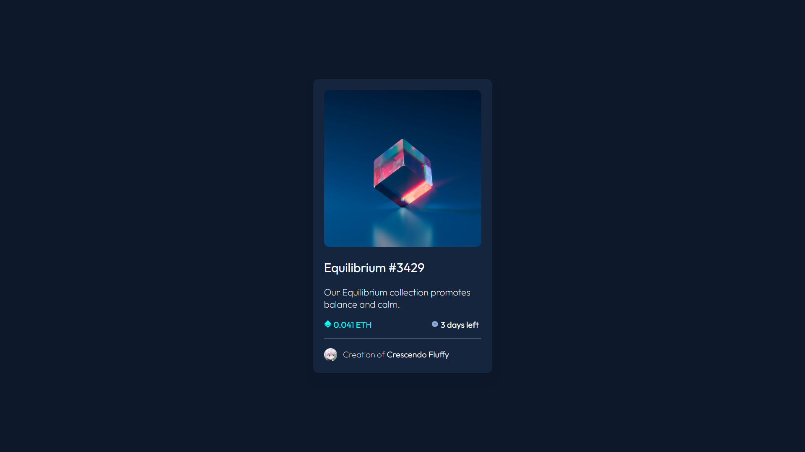

# Frontend Mentor - NFT preview card component solution

This is a solution to the [NFT preview card component challenge on Frontend Mentor](https://www.frontendmentor.io/challenges/nft-preview-card-component-SbdUL_w0U). Frontend Mentor challenges help you improve your coding skills by building realistic projects. 

## Table of contents

- [Frontend Mentor - NFT preview card component solution](#frontend-mentor---nft-preview-card-component-solution)
  - [Table of contents](#table-of-contents)
  - [Overview](#overview)
    - [Screenshot](#screenshot)
    - [Links](#links)
  - [My process](#my-process)
    - [Built with](#built-with)
    - [What I learned](#what-i-learned)
  - [Author](#author)

## Overview

### Screenshot

### Links

- Live Site URL: https://crescendofluffy.github.io/QR-Code-Component/

## My process

Rather than complicate this with using a framework, I felt using HTML and CSS on their own would be sufficient.

### Built with

- Semantic HTML5 markup
- CSS custom properties
- Flexbox

### What I learned

CSS Positioning and Manipulating hover effects

## Author

- GitHub - [Aditya K](https://github.com/CrescendoFluffy)
- Frontend Mentor - [@CrescendoFluffy](https://www.frontendmentor.io/profile/CrescendoFluffy)

